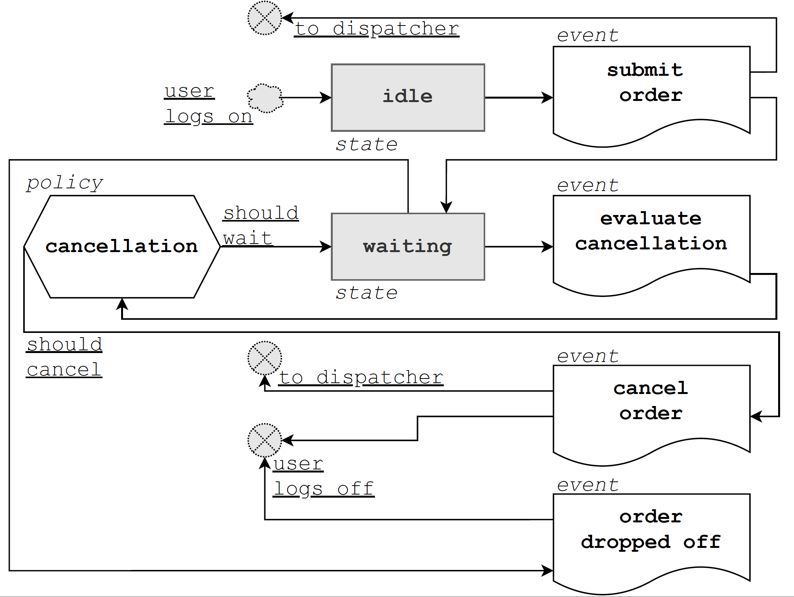
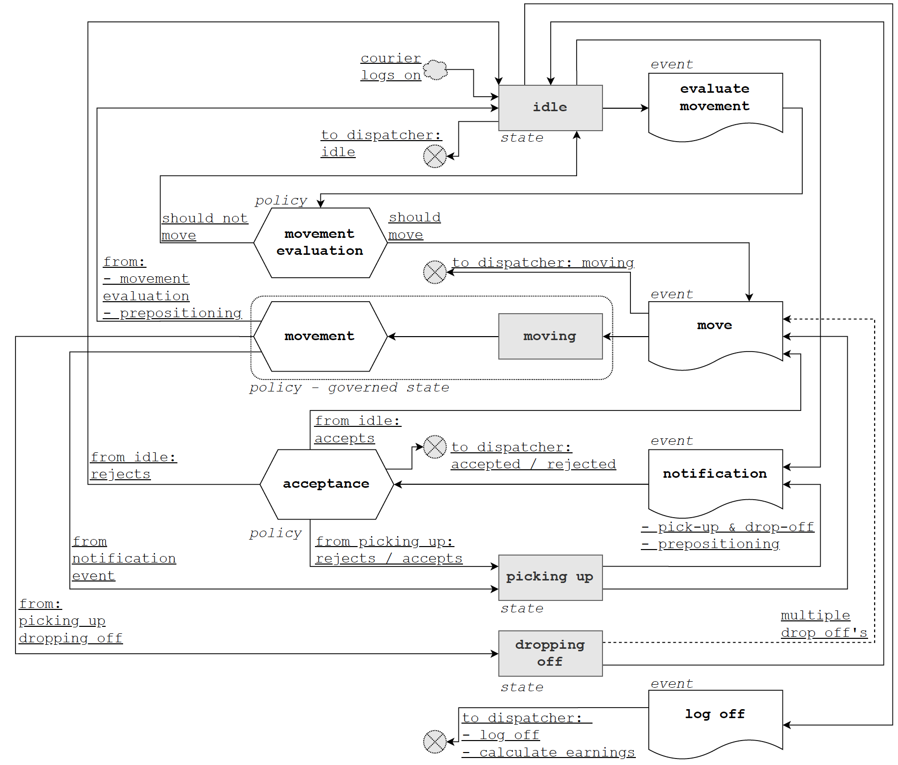

# mdrp-sim

This is a Meal Delivery Routing Problem Simulator (hence the name).
If you're in a hurry, check out:

-   [Quick Setup](#quick-setup)
-   [Use](#use)

If you have a bit more time on your hands, start reading from the [Intro](#intro) and work your way down.
Questions? Email me at: sebastianquinterorojas@gmail.com or connect with me via [Linkedin](https://www.linkedin.com/in/sebastian-quintero-rojas/).
The full academic document supporting this code can be downloaded [here](https://github.com/sebastian-quintero/mdrp-sim-doc/tree/master/_book).

## Quick Setup

Let's do a lightning fast setup via terminal.

1 - Install [python](https://www.python.org/) ([Anaconda](https://www.anaconda.com/) distribution recommended) and [Docker](https://www.docker.com/get-started).
Stand in the root of this project.

2 - Let's create a virtual environment for the project, install python requirements and make this the active python path.

```bash
conda create -n mdrp-sim python=3.7
conda activate mdrp-sim
pip install -r requirements.txt
export PYTHONPATH=.
```

If you intend to use Gurobi as a solver, please check out [How do I install Gurobi for Python?](https://support.gurobi.com/hc/en-us/articles/360044290292-How-do-I-install-Gurobi-for-Python-)
Out of the box, this project supports `pulp` as the default optimizer.

3 - Let's use docker to mount the Database.

```bash
docker pull postgres
docker run -p 5432:5432 --name mdrp-sim-db-container -e POSTGRES_USER='docker' -e POSTGRES_PASSWORD='docker' -e POSTGRES_DB='mdrp_sim' -d postgres
```

4 - In a separate terminal, let's use docker to mount the city routing ([OSRM](http://project-osrm.org/)) service (may take several minutes).

```bash
docker-compose up osrm_colombia
```

5 - Let's confirm the docker stuff is correctly set up (use the original terminal) with:

```bash
docker ps
```

You should see something like this:

```bash
CONTAINER ID        IMAGE               COMMAND                  CREATED             STATUS              PORTS                    NAMES
218befee50e3        postgres            "docker-entrypoint.s…"   2 seconds ago       Up 2 seconds        0.0.0.0:5432->5432/tcp   mdrp-sim-db-container
edcc1aac43cb        colombia_osrm       "/bin/sh -c 'osrm-ro…"   3 days ago          Up 17 minutes       0.0.0.0:5000->5000/tcp   mdrp-sim_osrm_colombia_1
```

6 - Set your project configurations in the `settings.py` file.

7 - Create the necessary tables in your DDBB and load the instance data into them (may take several minutes):

```bash
python3 ddbb/load_instances.py
```

If the terminal logs showed all instances were loaded to the DDBB and the connection was disposed, you're good to go.

## Use

Stand in the root of the project.

1 - Fire up two terminals. In the first one:

```bash
docker-compose up
```

2 - Open the second terminal an execute:

```bash
docker start mdrp-sim-db-container
```

Keep using the second terminal.

3 - To set the project's root as the `PYTHONPATH`, go ahead and type:

```bash
export PYTHONPATH=.
```

4 - Set desired params in the `settings.py` file and run the simulation with:

```bash
python3 simulate.py
```

5 - Check your local DDBB for the results in the following tables: `order_metrics`, `courier_metrics`, `matching_optimization_metrics`.
Go to the [DDBB](#ddbb) section for more information on queries.

## Intro

This project is a computational framework for solving the Meal Delivery Routing Problem.
The computational framework consists of a simulated environment.
Discrete events simulation is used and these are the most important definitions:

-   Event: A sequence of items, facts, actions or changes triggered at a moment in time that follow a chronological order.
-   Actor: Entity that makes decisions and executes actions (triggers events).
-   State: Current condition of an actor. Can also be defined as a sequence of events during a specific time interval.
-   Policy: Conditions and algorithms that describe how an actor makes a decision or executes an action.
-   Object: Passive entity used to represent an abstract object, person or place. Doesn't make decisions or execute actions.

This framework allows for different policies to be tested since the simulation groundwork is laid out agnostically.
A short explanation of this repo's directories can be found.
A more extended guide to get the project up and running is provided.

## 1. Directories

This project is composed of the following directories:

```bash
.
├── actors
├── ddbb
├── docker
├── instances
├── objects
├── policies
├── services
├── tests
├── utils
├── README.md
├── alembic.ini
├── docker-compose.yml
├── requirements.txt
├── settings.py
└── simulate.py

9 directories, 6 files
```

Let's dive into each directory.

### Actors

Here you can find the classes that handle the MDRP's actors states and events:

-   User
-   Courier
-   Dispatcher
-   World (passive actor that does not take actions and thus lacks policies, being used for orchestration only)

These are the events, states and policies that can be tested for each actor and the corresponding state transition diagrams.

#### User



-   Events

    -   Submit order event: details how the user submits a new order.
    -   Evaluate cancellation event: details how the user evaluates if it should cancel an order (incorporates cancellation policy).
    -   Cancel order event: details the actions taken by a user to cancel an order.
    -   Order dropped off: details the actions taken by a user when the order is dropped off.

-   States

    -   Idle state: passive actor state before submitting a new order.
    -   Waiting state: state in which the user is waiting for the order to be dropped off.

-   Policies
    -   Cancellation policy: establishes how a user decides to cancel an order.

#### Courier



-   Events

    -   Evaluate movement event: details how the courier decides if it should move (incorporates the movement evaluation policy).
    -   Move event: details the actions taken by the courier to move somewhere (incorporates the moving state and movement policy).
    -   Notification event: details how a courier handles a new notification (incorporates the acceptance policy and subsequently the picking up and dropping off statees).
    -   Log off event: details how the courier logs off of the system (includes earnings calculations).

-   States

    -   Idle state: stand-by state of the courier. After moving and executing notifications, the courier always comes back to this state.
    -   Moving state: establishes how the courier moves from an origin to a destination.
    -   Picking up state: details the actions taken by a courier for picking up orders.
    -   Dropping off state: details the actions taken by a courier for dropping off orders.

-   Policies
    -   Movement evaluation policy: establishes how a courier decides if and where it wants to relocate.
    -   Movement policy: establishes how the courier moves about the city and between route stops.
    -   Acceptance policy: establishes how a courier decides to accept or reject a notification.

#### Dispatcher


-   Events

    -   Order submitted event: details how the dispatcher handles the submission of a new order.
    -   Buffer order event: details how the dispatcher buffers a newly created order.
    -   Evaluate cancellation event: details the actions taken by the dispatcher to consider canceling an order (incorporates the cancellation policy).
    -   Cancel order event: steps that the dispatcher takes to cancel an order.
    -   Evaluate buffering event: establishes how the dispatcher evaluates if it should keep buffering orders or rather flush the buffer (incorporates the buffering policy and triggers the dispatch event).
    -   Dispatch event: actions taken by the dispatcher to route and match orders and couriers (incorporates the matching policy and triggers the notification event).
    -   Notification event: notify pick up & drop off notifications or prepositioning notifications to couriers.
    -   Preposition event: actions taken by the dispatcher to preposition couriers (incorporates the prepositioning policy and triggers the notification event).
    -   Evaluate prepositioning event: details the actions taken by the dispatcher to consider executing a prepositioning cycle.
    -   Update / Control event: the dispatcher has the faculty of controlling an updating the system based on what is happening. As such, it is in charge of updating user, order and courier properties.

-   States

    -   Listening state: the sole state of the dispatcher, since the role of this actor is to react and coordinate system changes.

-   Policies
    -   Cancellation policy: establishes how the dispatcher decides to cancel an order.
    -   Buffering policy: establishes how the dispatcher buffers orders before dispatching them.
    -   Matching policy: establishes how the dispatcher executes routing and matching between orders and couriers.
    -   Prepositioning policy: establishes how the dispatcher executes prepositioning of couriers.
    -   Prepositioning evaluation: establishes how the dispatcher decides if prepositioning should be done and how often.

### DDBB

All scripts and migrations necessary for the Data Base (DDBB) to work live here.
Here is an explanation of the tables and queries you can use, for exploring both the inputs and the outputs of the simulation.

#### orders_instance_data

Information for the input of the simulator, regarding orders.

With this query you can have an overview:

```sql
SELECT *
FROM orders_intance_data
LIMIT 10
```

With this query you can get all the orders for a specific instance

```sql
SELECT *
FROM orders_instance_data
WHERE instance_id = $instance_id
```

Description of columns loaded to this table can be found in [Instances](#instances).

#### couriers_instance_data

Information for the input of the simulator, regarding couriers.

With this query you can have an overview:

```sql
SELECT *
FROM couriers_instance_data
LIMIT 10
```

With this query you can get all the couriers for a specific instance:

```sql
SELECT *
FROM couriers_instance_data
WHERE instance_id = $instance_id
```

#### order_metrics

Results of a simulation, regarding orders.
Many columns from the `orders_instance_data` can be found here for traceability.
Here are interesting columns in this table:

-   `simulation_settings`: JSON containing information of the simulation configuration
-   `simulation_policies`: JSON containing the policies used in the simulation.
-   `extra_settings`: JSON containing all other inputs of the simulation.
-   `dropped_of`: Boolean stating if an order was dropped off or otherwise canceled.

Some Float columns with the corresponding metrics are (for an order that dropped off):

-   `click_to_door_time`
-   `click_to_taken_time`
-   `ready_to_door_time`
-   `ready_to_pick_up_time`
-   `in_store_to_pick_up_time`
-   `drop_off_lateness_time`

If an order was canceled, the column `click_to_cancel_time` will contain the cancellation time.
Other columns for obtaining these metrics are available.

With this query you can get the metrics for orders in a specific instance, that were delivered:

```sql
SELECT order_id, click_to_door_time, click_to_taken_time, ready_to_door_time, in_store_to_pick_up_time, drop_off_lateness_time
FROM order_metrics
WHERE instance_id = $instance_id AND dropped_off
```

With this query you can get the metrics for orders in a specific instance, with particular policies, that were canceled:

```sql
SELECT order_id, click_to_door_time, click_to_taken_time, ready_to_door_time, in_store_to_pick_up_time, drop_off_lateness_time
FROM order_metrics
WHERE
    instance_id = $instance_id AND
    dropped_off AND
    simulation_policies ->> 'DISPATCHER_MATCHING_POLICY' LIKE 'mdrp' AND
    simulation_policies ->> 'COURIER_ACCEPTANCE_POLICY' LIKE 'uniform'
```

#### courier_metrics

Results of a simulation, regarding couriers.
Many columns from the `couriers_instance_data` can be found here for traceability.
Here are interesting columns in this table:

-   `simulation_settings`: JSON containing information of the simulation configuration
-   `simulation_policies`: JSON containing the policies used in the simulation.
-   `extra_settings`: JSON containing all other inputs of the simulation.

Some Float columns with the corresponding metrics are:

-   `courier_utilization`
-   `courier_delivery_earnings`
-   `courier_compensation`
-   `courier_orders_delivered_per_hour`
-   `courier_bundles_picked_per_hour`

Other columns for obtaining these metrics are available.

With this query you can get the metrics for couriers in a specific instance:

```sql
SELECT courier_id, courier_utilization, courier_delivery_earnings, courier_compensation, courier_orders_delivered_per_hour, courier_bundles_picked_per_hour
FROM courier_metrics
WHERE instance_id = $instance_id
```

With this query you can get the metrics for couriers in a specific instance, with particular policies:

```sql
SELECT courier_id, courier_utilization, courier_delivery_earnings, courier_compensation, courier_orders_delivered_per_hour, courier_bundles_picked_per_hour
FROM courier_metrics
WHERE
    instance_id = $instance_id AND
    simulation_policies ->> 'DISPATCHER_MATCHING_POLICY' LIKE 'modified_mdrp' AND
    simulation_policies ->> 'COURIER_MOVEMENT_EVALUATION_POLICY' LIKE 'neighbors'
```

#### matching_optimization_metrics

Results of a simulation, regarding matches obtained during various moments of the simulation.
Here are interesting columns in this table:

-   `simulation_settings`: JSON containing information of the simulation configuration
-   `simulation_policies`: JSON containing the policies used in the simulation.
-   `extra_settings`: JSON containing all other inputs of the simulation.

Other Integer and Float columns with data of the optimization problem solved are:

-   `orders`
-   `routes`
-   `couriers`
-   `variables`
-   `constraints`
-   `routing_time`
-   `matching_time`
-   `matches`

With this query you can get the metrics for optimizations in a specific instance:

```sql
SELECT id, orders, routes, couriers, variables, constraints, routing_time, matching_time, matches
FROM matching_optimization_metrics
WHERE instance_id = $instance_id
```

With this query you can get the metrics for optimizations in a specific instance, with particular policies:

```sql
SELECT id, orders, routes, couriers, variables, constraints, routing_time, matching_time, matches
FROM matching_optimization_metrics
WHERE
    instance_id = $instance_id AND
    simulation_policies ->> 'DISPATCHER_MATCHING_POLICY' LIKE 'modified_mdrp' AND
    simulation_policies ->> 'COURIER_MOVEMENT_EVALUATION_POLICY' LIKE 'neighbors'
```

### Docker

Files for managing docker stuff. Two containers are used: managing the DDBB and the OSRM service.

### Instances

Here the different instances for testing out the `mdrp-sim` can be found.
For each instance there are two files: `couriers.csv` and `order.csv`.
Each instance is a complete day of operation (12 a.m. to 11:59 p.m.) for a specific city.

The `couriers.csv` file contains information about all the couriers that came online for that day and contains the following columns:

-   courier_id: an id to identify a courier.
-   vehicle: mode of transportation. Can be: walking, bicycle, motorcycle or car.
-   on_lat: latitude of the courier's position at the start of the shift.
-   on_lng: longitude of the courier's position at the start of the shift.
-   on_time: timestamp detailing when the courier started the shift.
-   off_time: timestamp detailing when the courier ended the shift.

the `orders.csv` file contains information about all the orders processed during the day and contains the following columns:

-   order_id: and id to identify an order.
-   pick_up_lat: latitude of the order's pick_up location.
-   pick_up_lng: longitude of the order's pick_up location.
-   drop_off_lat: latitude of the order's drop_off location.
-   drop_off_lng: longitude of the order's drop_off location.
-   placement_time: timestamp detailing the order's creation time.
-   preparation_time: timestamp detailing when the order starts being prepared.
-   ready_time: timestamp detailing when the order is ready to be picked up.
-   expected_drop_off_time: timestamp detailing when the order should be dropped off.

In the DDBB, the tables `couriers_instance_data` and `orders_instance_data` contain the information for the different instances.

### Objects

The different class objects used for the MDRP can be found here, such as:

-   Order
-   Route
-   Stop
-   Vehicle
-   ...

### Policies

Interchangeable policies used by the actors can be found here.
A policy dictates the logic and actions that must be executed by an actor after some event.
Some of the policies are:

-   Movement policy for the Courier
-   Cancellation policy for the Dispatcher
-   Acceptance policy for the Courier
-   ...

You can go back to the [Actors](#actors) for greater detail.

### Services

Services for the simulator, such as the city routing service (OSRM) and the optimization service can be found here.
These services may be used by policies or actors in different ways and provide complex functionality for some specific purpose.

### Tests

Suite for unit testing the code

### Utils

Project's utils can be found here. From logging to mathematical auxiliary functions.

## 2. Set up

This section is an extension of the [Quick Setup](#quick-setup) section.
Please take your time to correctly set up the project.

### Python

It is highly recommended that [Anaconda](https://www.anaconda.com/) is used as the python distribution.
For python projects, it is recommended that a virtual environment is used to set things up.
After Anaconda is installed and correctly set up, please open a terminal console and stand in the root of the project.

Let's create the environment with:

```bash
conda create -n mdrp-sim python=3.7
```

Now, let's activate said environment:

```bash
conda activate mdrp-sim
```

Make sure you are standing in the environment every time you are trying to run the project. The full env list can be seen using `conda env list`.

It is time to install the requirements used in the project.
Let's install the open source libraries in a single step.
Run the following command :

```bash
pip install -r requirements.txt
```

If you have any trouble installing these libraries, be aware that the requirements are listed in the file `requirements.txt`.
Sometimes it's best to install problematic libraries by hand and omitting them from the `requirements.txt` file.
In such case run the following command:

```bash
pip install library_name
```

If you intend to use Gurobi as a solver, please check out [How do I install Gurobi for Python?](https://support.gurobi.com/hc/en-us/articles/360044290292-How-do-I-install-Gurobi-for-Python-)
Out of the box, this project supports `pulp` as the default optimizer.

Let's use the directory's root as the python path, to avoid confusion of directory handling.
Stand in the root of the `mdrp-sim` directory and execute the following command (Mac & Linux):

```bash
export PYTHONPATH=.
```

Cool! Python and the requirements are all set up!

### Docker

Please make sure you have [Docker](https://www.docker.com/get-started) installed.
Docker will be used to manage the Database (postgresql) and the [OSRM](http://project-osrm.org/) service.

### Open Source Routing Machine

To have a OSRM that delivers city routes mounted in your local environment, we will mount it via Docker.
All the instances herein contained belong to the country Colombia. As such, we will:

1. Download the [OpenStreetMap](https://www.openstreetmap.org/#map=6/4.632/-74.299) graph for Colombia from [Geofabrik](https://www.geofabrik.de/geofabrik/).
1. Use a bounding box to use the part of the country that is useful for the instances and extract it with [osmcode.org](https://osmcode.org/).
1. Extract the car profile for the map.
1. Mount a web server on port 5000 with `osrm-routed` using the Contraction Hierarchies (CH) algorithm.
1. Listen for requests and return the route for a lat, lng origin and destination.

To accomplish all of this, stand in the root of the project and run the following command:

```bash
docker-compose up osrm_colombia
```

This process may take several minutes to complete. When it's done, you should see something like this:

```bash
Starting mdrp-sim_osrm_colombia_1 ... done
Attaching to mdrp-sim_osrm_colombia_1
osrm_colombia_1  | [info] starting up engines, v5.22.0
osrm_colombia_1  | [info] Threads: 8
osrm_colombia_1  | [info] IP address: 0.0.0.0
osrm_colombia_1  | [info] IP port: 5000
osrm_colombia_1  | [info] http 1.1 compression handled by zlib version 1.2.8
osrm_colombia_1  | [info] Listening on: 0.0.0.0:5000
osrm_colombia_1  | [info] running and waiting for requests
```

To stop the server you may use `ctrl+c`.
Next time the server starts, it will do so immediately since all the data is ready.
At any time you may check if the container is running using this command in a different terminal:

```bash
docker ps
```

You should see something like this:

```bash
CONTAINER ID        IMAGE               COMMAND                  CREATED             STATUS              PORTS                    NAMES
edcc1aac43cb        colombia_osrm       "/bin/sh -c 'osrm-ro…"   3 days ago          Up 2 minutes        0.0.0.0:5000->5000/tcp   mdrp-sim_osrm_colombia_1
```

If the container is running then cool! OSRM is all set up.

### Postgresql

This project saves the information in a postgresql relational data base.
It is recommended that Docker is used to handle the DDBB.

Let's start by pulling the latest postgresql image:

```bash
docker pull postgres
```

Let's build the container and name it `mdrp-sim-db-container`:

```bash
docker run -p 5432:5432 --name mdrp-sim-db-container -e POSTGRES_USER='docker' -e POSTGRES_PASSWORD='docker' -e POSTGRES_DB='mdrp_sim' -d postgres
```

Data will be stored in the DDBB each time the service is run.
Note that the DDBB has a user and a password (both are `docker`).
The name of the DDBB is set to `mdrp_sim`.

Let's check if the postgresql container is running correctly with:

```bash
docker ps
```

You should see something similar to:

```bash
CONTAINER ID        IMAGE               COMMAND                  CREATED             STATUS              PORTS                    NAMES
a32029bf4010        postgres            "docker-entrypoint.s…"   7 months ago        Up 1 second         0.0.0.0:5432->5432/tcp   mdrp-sim-db-container
```

If the container is running, cool! Postgresql is all set up!

#### Migrations

To interact with the DDBB for adding/removing schemas, tables and columns, a migration must be performed.

First of all, let's make sure the `PYTHONPATH` is set correctly. Stand at the root of the project and run:

```bash
export PYTHONPATH=.
```

To check the current migrations you can run:

```bash
alembic history
```

To execute migrations manually you can run:

```bash
alembic upgrade head
```

To create a new migration automatically, you can run:

```bash
alembic revision --autogenerate -m "<migration_message>"
```

With this last command, a new file should've been generated at `./ddbb/versions/`.
